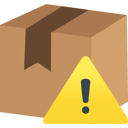

# AmznShipWarn
A browser extension that adds a warning to the Amazon page, if the item is not shipped by Amazon directly

## How to install
### Firefox 🦊
For Firefox, you can directly get the extension from the offical Add-On page.  
Also works on Firefox for Android™ 

### Chrome 🔵🔴🟡🟢
For Google Chrome (and most Chromium-based browsers), you can get the extension from the official Chrome Web Store.

**Note:** If you use a chromium based browser, but don't want to use the official Chrome Web Store, yo can still install the extension manually:
1. Download the `.zip` from the [latest release](https://github.com/MrMinemeet/AmznShipWarn/releases/latest)
2. In Chrome, go to `chrome://extensions/` and enable Developer Mode
3. Drag and drop the `.zip` file into the Chrome window

You won't get automatic updates, but you can watch this repository to get notified about new releases.

## How does it work?
The exension checks the page for the text that holds the shipping information. If the text contains the word "Amazon", the extension does nothing. If the text does not contain the word "Amazon", the extension adds a warning to the page. In order to get the user's attention and make them aware of potential shipping costs.

## Currently supported Amazon sites
The following Amazon sites are currently supported, but not every site has been tested.
Furthermore, not every site has it's own translation for the warning message.

	
Click to see all supported Amazon domains

	<ul>
		<li>amazon.com</li>
		<li>amazon.co.uk</li>
		<li>amazon.ca</li>
		<li>amazon.com.au</li>
		<li>amazon.de</li>
		<li>amazon.fr</li>
		<li>amazon.it</li>
		<li>amazon.es</li>
		<li>amazon.nl</li>
		<li>amazon.com.br</li>
		<li>amazon.in</li>
		<li>amazon.co.jp</li>
		<li>amazon.cn</li>
		<li>amazon.com.mx</li>
		<li>amazon.sa</li>
		<li>amazon.eg</li>
		<li>amazon.sg</li>
		<li>amazon.com.tr</li>
	</ul>

## Development Dependencies
For building the extension as expected by the browsers, you need to have the following dependencies installed:
- Node.js
- pnpm
- dev-dependencies (see [package.json](./package.json#L31))

### How to build
1. Clone the repository
2. Run `pnpm install` to install the dependencies
3. Run `pnpm build` to build the extension
4. The built extension is located in the `out` folder

---

# Trademarks & Attribution
This extension is not affiliated with Amazon or any of the other mentioned entities in any way. This extension just provides a visual warning to the user.

* The "*Get the Add-on*" image is provided at [Extensionworkshop.com](https://extensionworkshop.com/documentation/publish/promoting-your-extension/#promote-your-addon) by the Mozilla Foundation.

* Android is a trademark of Google LLC. 

* The "*Available in the Chrome Web Store*" image is provided in the [Brand Guidelines](https://developer.chrome.com/docs/webstore/branding/) by the Google LLC.